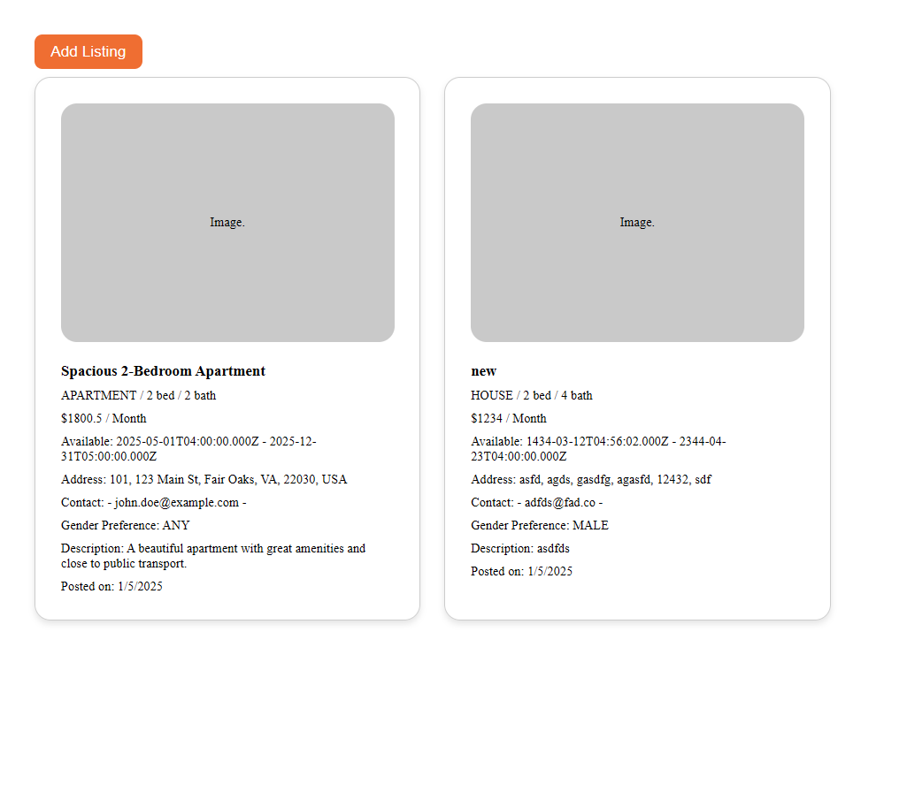
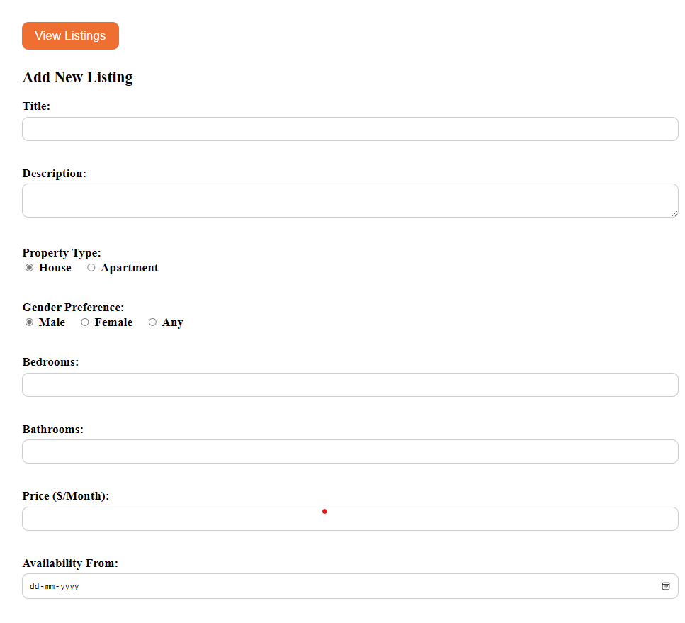
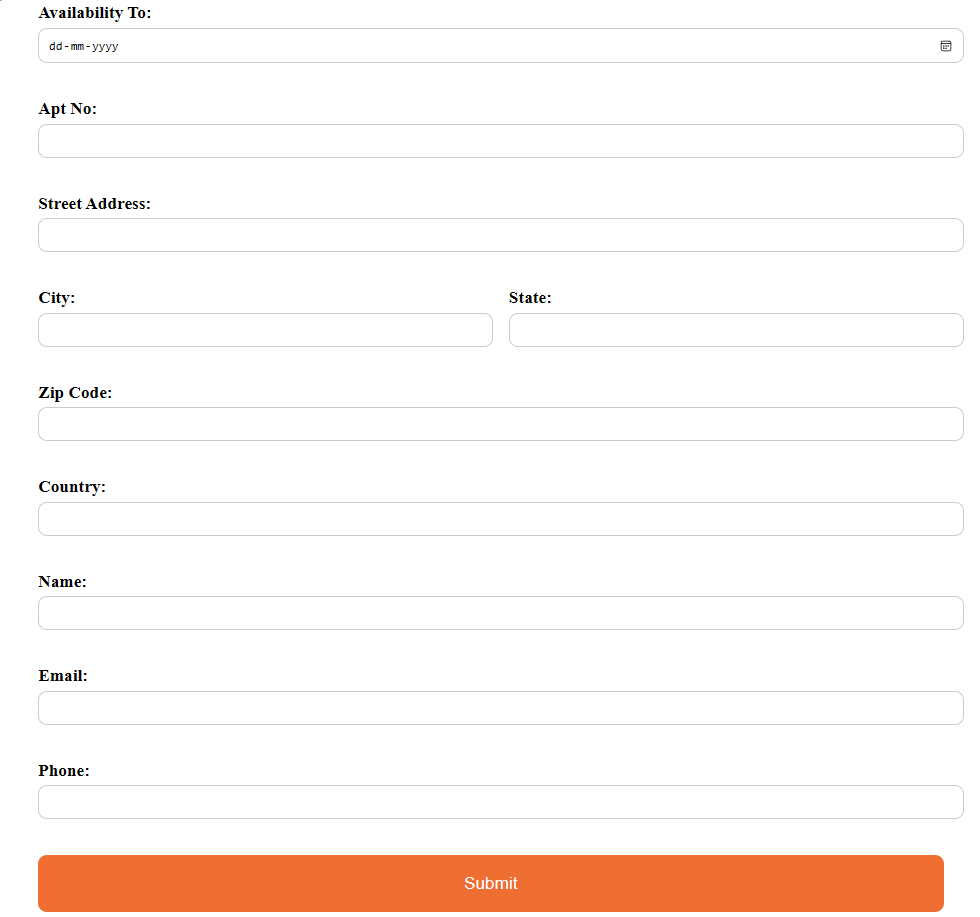

## Overview
This repository contains the solution for the problem statement. It includes a backend application implemented in both Spring Framework and Express.js, as well as a dedicated frontend for displaying and creating listings.

### Listings view


### Listings Form



## Installation 

## Spring backend application
### Prerequisites

- Java 11 or higher
- Maven
- MySQL

### Setup

1. Clone the repository:
   
   ```bash
   git clone https://github.com/dheerajkrishna141/housing-panda.git
2. Navigate to the project directory:
   
   ```bash
   cd backend\spring
3. Configure the environment variables for database connection in
   
   ```src/main/resources/application.properties:```

4. Build the project:
   ```bash
   mvn clean install
5. Run the project:
   ```bash
   mvn spring-boot:run


## ExpressJs backend application

1. Clone the repository:
   
   ```bash
   git clone https://github.com/dheerajkrishna141/housing-panda.git
2. Navigate to the project directory:
   
   ```bash
   cd backend\express
3. Install project dependencies:
   ```bash
   npm install
4. Configure the environment variables (mentioned in `src/database.js`) for database connection by creating a `.env`.
   
5. Run `npm run dev` to start the web server


## React frontend application

1. Clone the repository:
   
   ```bash
   git clone https://github.com/dheerajkrishna141/housing-panda.git
2. Navigate to the project directory:
   
   ```bash
   cd frontend
3. Install project dependencies:
   ```bash
   npm install
4. Configure the environment variable (mentioned in `src/service/api-client.ts`) for backend connection by creating a `.env`.

5. Run `npm run dev` to start the web server

   
